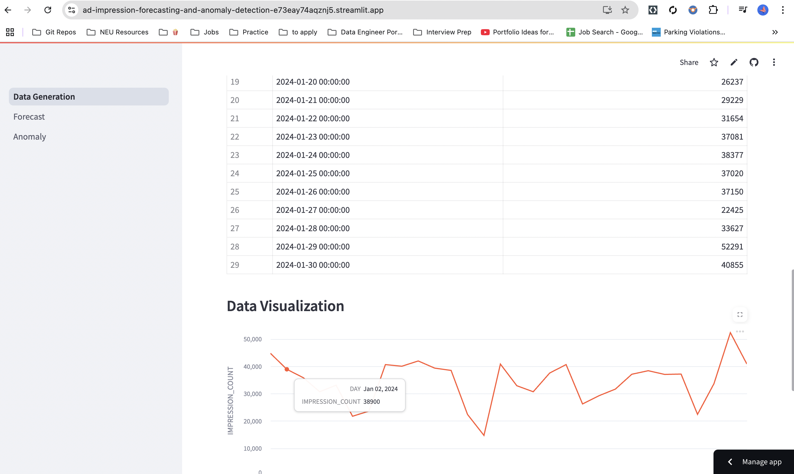
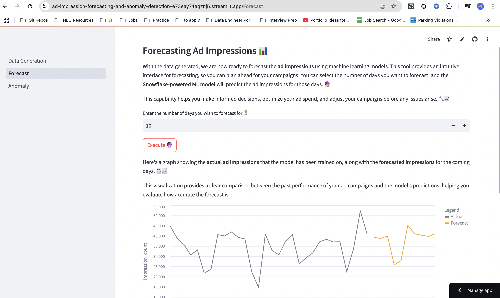
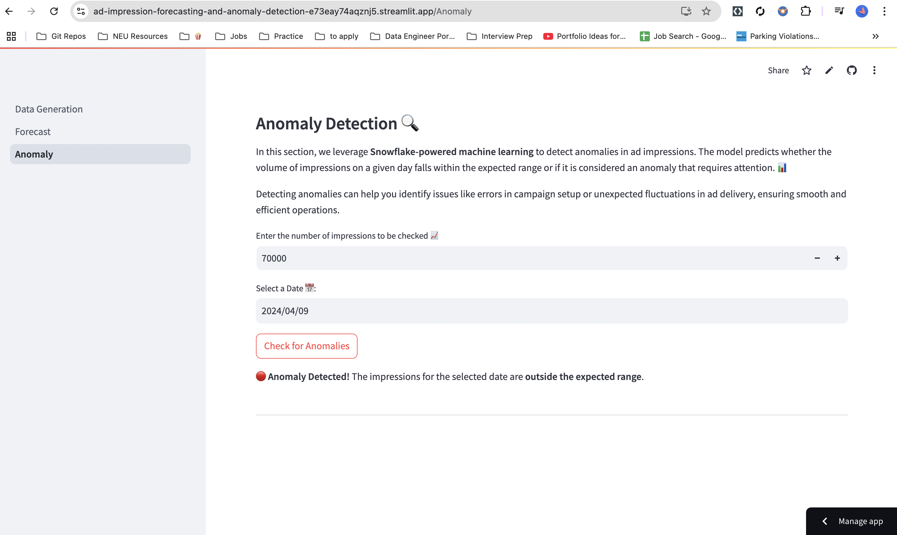

# Ad Impression Forecasting and Anomaly Detection

This project aims to forecast ad impressions using machine learning techniques, leveraging Snowflake's ML-Powered Analysis. The goal is to predict the number of times an ad will be displayed to users based on historical data, user behavior, and external factors. Accurate forecasting helps optimize ad budgets and maximize campaign effectiveness. Additionally, the project includes anomaly detection to identify unusual patterns in impression data.

## Features
- **Synthetic Data Generation**: Generate realistic ad impression data with trends based on weekdays and weekends.
- **Forecasting**: Predict future ad impression volumes using Snowflake’s ML models.
- **Anomaly Detection**: Identify discrepancies in impression data to detect anomalies.

## Access the Application
- **Streamlit App**: [Click here](https://ad-impression-forecasting-and-anomaly-detection-e73eay74aqznj5.streamlit.app/)

## Snowflake Setup 
Followed along [this documnetation](https://quickstarts.snowflake.com/guide/predict_ad_impressions_with_ml_powered_analysis/index.html#1) provided by Snowflake to set up the snowflake account, role and data warehouse, schema.

## Project Structure:
```
📦 Ad-Impression-Forecasting-and-Anomaly-Detection
.gitignore
├─ Data_Generation
README.md
├─ functions
│  ├─ execute_query.py
│  └─ read_query.py
├─ pages
│  ├─ 01_Forecast.py
│  └─ 02_Anomaly.py
├─ queries
│  ├─ anomaly
│  │  ├─ anomaly_call_script.sql
│  │  └─ anomaly_model_script.sql
│  ├─ data
│  │  ├─ data_fetch_script.sql
│  │  ├─ data_generation_script.sql
│  │  ├─ delete_script.sql
│  │  └─ trend_addition_script.sql
│  └─ forecast
│     ├─ forecast_call_script.sql
│     └─ forecast_model_script.sql
└─ requirements.txt
```

## Pages Overview

### Page 1: Generate Data
- Enter a date and specify the number of days to generate synthetic ad impression data.
- Data is adjusted to reflect trends: an upward trend on weekdays and a downward trend on weekends.
  

### Page 2: Forecasting Ad Impressions 📈
- Train an ML model using the generated data to forecast future ad impressions.
- Input the desired number of forecast days to receive predictions.
  


### Page 3: Anomaly Detection
- A Snowflake-ML model is trained to detect anomalies in ad impression volumes.
- The model predicts whether an impression count for a given day is normal or an anomaly.
  

